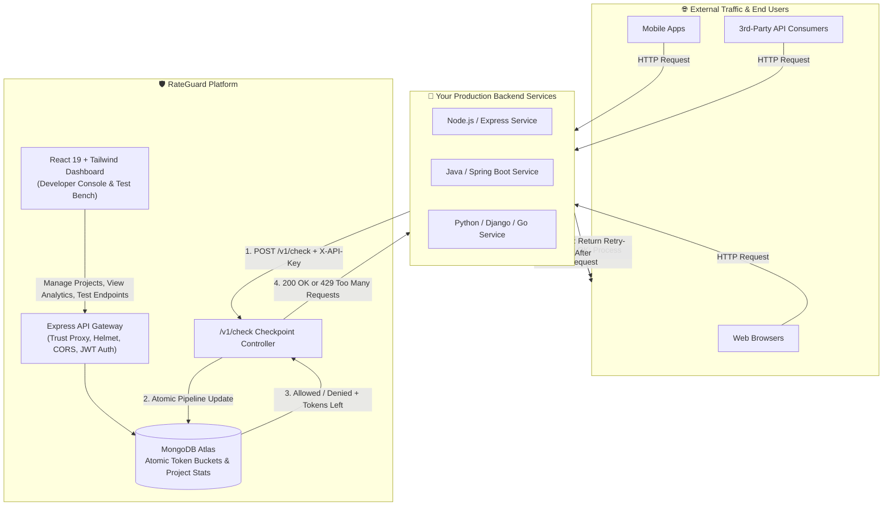
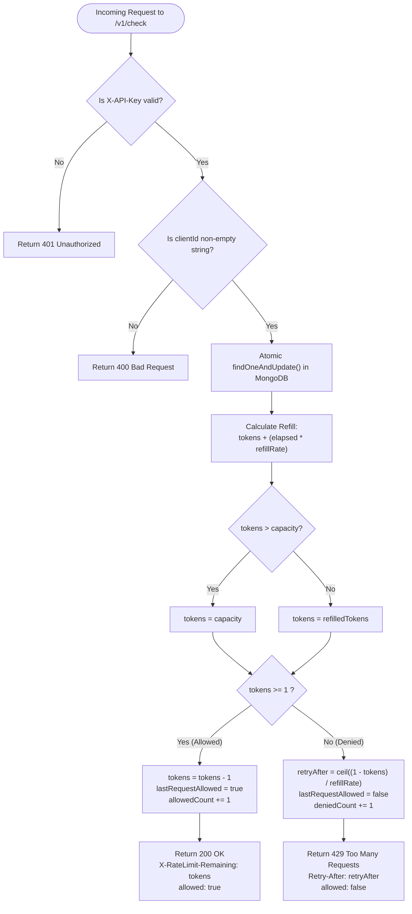
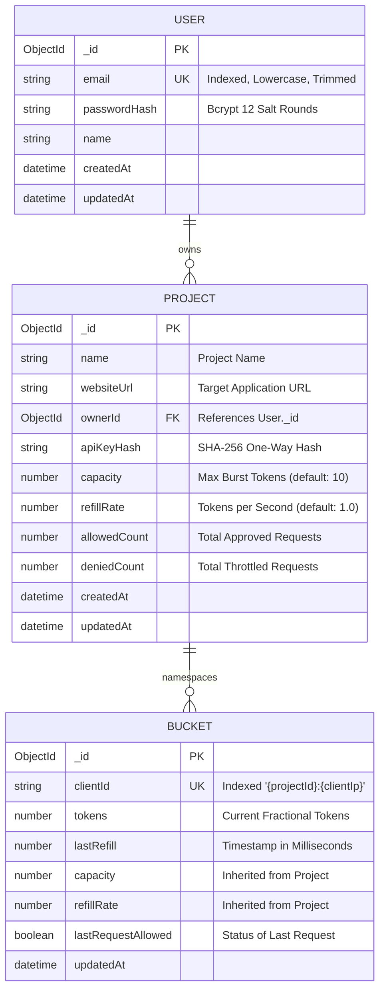

# 🛡️ RateGuard — Distributed Rate Limiter SaaS

> A production-ready, multi-tenant Rate Limiting as a Service platform powered by the **Token Bucket Algorithm**, **MongoDB Atomic Aggregation Pipelines**, **Node.js/Express**, and a **React 19 Dashboard**.

---

## 📑 Table of Contents
- [1. Plain English Overview (For Non-Tech & Tech Alike)](#-1-plain-english-overview)
- [2. High-Level Architecture (HLD)](#-2-high-level-architecture-hld)
- [3. Low-Level Design (LLD) & Algorithms](#-3-low-level-design-lld--algorithms)
  - [The Token Bucket Algorithm Explained](#the-token-bucket-algorithm-explained)
  - [Rate Limiting Decision Flowchart](#rate-limiting-decision-flowchart)
  - [Atomic MongoDB Pipeline (Race-Condition Free)](#atomic-mongodb-pipeline-race-condition-free)
  - [Database Schema (Entity Relationship Diagram)](#database-schema-entity-relationship-diagram)
- [4. Key Features](#-4-key-features)
- [5. API Reference & Headers](#-5-api-reference--headers)
- [6. Client Integration Guides](#-6-client-integration-guides)
  - [Node.js / Express Middleware](#nodejs--express-middleware)
  - [Spring Boot Filter](#spring-boot-filter)
- [7. Project Structure](#-7-project-structure)
- [8. Getting Started & Local Setup](#-8-getting-started--local-setup)
- [9. Production Deployment Guide](#-9-production-deployment-guide)

---

## 💡 1. Plain English Overview

### The Metaphor: The Digital Water Bucket
Imagine you run a popular café. If 500 customers barge through the door in the same second, the barista crashes and nobody gets served.

To solve this, you place a **token turnstile** at the entrance:
1. **The Bucket**: Each customer has a bucket that can hold up to **10 tokens** (*Capacity*).
2. **The Refill**: The turnstile automatically drops **1 new token** into their bucket every second (*Refill Rate*).
3. **The Entry**: Every time a customer orders, they must spend **1 token**.
   - If they have a token: They enter immediately (**Allowed ✅**).
   - If their bucket is empty: They are told to wait a few seconds until a new token drops in (**Denied / 429 Too Many Requests ❌**).

### What is RateGuard?
**RateGuard** is a centralized, cloud-hosted security layer that acts as this turnstile for modern websites and APIs. It allows developers to register projects, configure custom limits, obtain secret API keys, and protect their servers against:
- **DDoS Attacks & API Hammering** (protecting servers from crashing under sudden spikes).
- **Brute-Force & Credential Stuffing** (preventing hackers from guessing passwords).
- **Runaway Third-Party Cloud Bills** (stopping accidental infinite loops in client applications).

---

## 🏗️ 2. High-Level Architecture (HLD)

RateGuard decouples rate-limiting logic from your core business microservices. Client applications send an ultra-fast verification request to RateGuard before executing expensive database queries or business operations.



---

## ⚙️ 3. Low-Level Design (LLD) & Algorithms

### The Token Bucket Algorithm Explained
The token bucket algorithm provides a smooth, fair rate limiting experience that naturally supports **instant traffic bursts** while enforcing a **sustainable average rate**.

$$\text{Elapsed Time} = \frac{\text{Current Time} - \text{Last Refill Time}}{1000} \text{ (seconds)}$$

$$\text{Refilled Tokens} = \min\left(\text{Capacity}, \text{Tokens} + (\text{Elapsed Time} \times \text{Refill Rate})\right)$$

$$\text{If } \text{Refilled Tokens} \ge 1 \implies \text{Allowed}, \quad \text{New Tokens} = \text{Refilled Tokens} - 1$$

$$\text{If } \text{Refilled Tokens} < 1 \implies \text{Denied}, \quad \text{Retry-After} = \left\lceil \frac{1 - \text{Refilled Tokens}}{\text{Refill Rate}} \right\rceil \text{ (seconds)}$$

---

### Rate Limiting Decision Flowchart



---

### Atomic MongoDB Pipeline (Race-Condition Free)

In multi-instance cloud deployments, two concurrent requests arriving at the same millisecond could cause a **Race Condition** if handled with a standard `read -> calculate in memory -> write back` pattern:

> ⚠️ **The Race Condition Vulnerability**: Request A reads 1 token. Request B reads 1 token. Both allow the request and write 0 tokens. Result: The user used 2 tokens when only 1 existed!

#### RateGuard's Solution: Single-Roundtrip Atomic Update Pipeline
RateGuard executes the mathematical calculation **inside the database engine** using MongoDB 4.2+ Aggregation Pipelines within `findOneAndUpdate`:

```javascript
// server/src/lib/bucketService.js
const updatePipeline = [
  // Step 1: Initialize defaults if new bucket
  {
    $set: {
      clientId: clientId,
      capacity: { $ifNull: ["$capacity", capacity] },
      refillRate: { $ifNull: ["$refillRate", refillRate] },
      tokens: { $ifNull: ["$tokens", capacity] },
      lastRefill: { $ifNull: ["$lastRefill", now] },
    },
  },
  // Step 2: Compute continuous refill bounded by capacity
  {
    $set: {
      refilledTokens: {
        $let: {
          vars: {
            elapsed: { $divide: [{ $subtract: [now, "$lastRefill"] }, 1000] },
          },
          in: {
            $min: ["$capacity", { $add: ["$tokens", { $multiply: ["$$elapsed", "$refillRate"] }] }],
          },
        },
      },
      lastRefill: now,
    },
  },
  // Step 3: Conditionally consume 1 token
  {
    $set: {
      tokens: {
        $cond: [
          { $gte: ["$refilledTokens", 1] },
          { $subtract: ["$refilledTokens", 1] },
          "$refilledTokens",
        ],
      },
      lastRequestAllowed: { $gte: ["$refilledTokens", 1] },
    },
  },
  { $unset: "refilledTokens" },
];
```
- **100% Lock-Free**: No distributed Redis locks or mutexes required.
- **Zero Race Conditions**: Guaranteed linear consistency across any number of server replicas.

---

### Database Schema (Entity Relationship Diagram)



---

## 🌟 4. Key Features

- **🔐 One-Way Hashed API Keys**: Raw API keys are displayed exactly once upon project creation. Only the cryptographic SHA-256 hash is persisted in the database.
- **🛡️ Defense in Depth**:
  - Global Express rate limiter (100 req/min).
  - Dedicated Authentication brute-force protection (20 attempts / 15 mins).
  - Checkpoint fallback limiter (120 req/min on `/v1/check`).
  - Helmet security headers and strict 10kb JSON body size limit.
- **📊 Real-Time Developer Dashboard**: Built with React 19 and Tailwind CSS. Provides instant visibility into allowed vs. denied request metrics per project.
- **🧪 Interactive Test Bench**: Built-in test sandbox to fire single requests or simulate concurrent bursts (1 to 50 simultaneous calls) with live latency, token count, and retry timer readouts.
- **⚡ Production Hardened**:
  - Unthrottled `/health` endpoint positioned for zero-failure load balancer health probes.
  - Full `SIGTERM` / `SIGINT` lifecycle handling for graceful server draining and database connection teardown.

---

## 📡 5. API Reference & Headers

### Core Checkpoint: `POST /v1/check`
Used by integrated microservices to check if a client request should be allowed.

#### Headers
| Header | Type | Description |
| :--- | :--- | :--- |
| `Content-Type` | `application/json` | `application/json` |
| `X-API-Key` | `string` | **Required**. The secret API key of the project. |

#### Request Body
```json
{
  "clientId": "192.168.1.1"
}
```

#### Response: `200 OK` (Allowed)
```json
{
  "allowed": true,
  "retryAfter": 0,
  "tokens": 4.5
}
```
**Response Headers**:
- `X-RateLimit-Limit: 10`
- `X-RateLimit-Remaining: 4`

#### Response: `429 Too Many Requests` (Throttled)
```json
{
  "error": "Too Many Requests",
  "msg": "Rate limit exceeded",
  "retryAfter": 3
}
```
**Response Headers**:
- `Retry-After: 3`
- `X-RateLimit-Limit: 10`
- `X-RateLimit-Remaining: 0`

---

## 🔌 6. Client Integration Guides

### Node.js / Express Middleware

Add this lightweight middleware to your Node.js application to guard your routes with RateGuard:

```javascript
const RATEGUARD_URL = process.env.RATEGUARD_URL || 'https://your-rateguard-deployment.onrender.com/v1/check';
const RATEGUARD_API_KEY = process.env.RATEGUARD_API_KEY;

async function rateGuardMiddleware(req, res, next) {
  try {
    const response = await fetch(RATEGUARD_URL, {
      method: 'POST',
      headers: {
        'Content-Type': 'application/json',
        'X-API-Key': RATEGUARD_API_KEY,
      },
      body: JSON.stringify({ clientId: req.ip }),
    });

    const data = await response.json();

    if (response.status === 429 || data.allowed === false) {
      res.setHeader('Retry-After', data.retryAfter || 1);
      return res.status(429).json({
        error: 'Too Many Requests',
        message: 'Rate limit exceeded. Please slow down.',
        retryAfter: data.retryAfter,
      });
    }

    // Forward standard rate-limit headers to client
    if (response.headers.get('X-RateLimit-Remaining')) {
      res.setHeader('X-RateLimit-Remaining', response.headers.get('X-RateLimit-Remaining'));
      res.setHeader('X-RateLimit-Limit', response.headers.get('X-RateLimit-Limit'));
    }

    next();
  } catch (err) {
    // Fail-open strategy: allow user traffic if RateGuard is temporarily unreachable
    console.error('[RateGuard] Warning: Rate check failed, failing open:', err.message);
    next();
  }
}

app.use(rateGuardMiddleware);
```

---

### Spring Boot Filter

Integrate RateGuard into a Java Spring Boot application using a `OncePerRequestFilter`:

```java
@Component
public class RateLimitFilter extends OncePerRequestFilter {

    private final RestClient restClient;
    private final String apiKey;

    public RateLimitFilter(
            @Value("${ratelimiter.base-url}") String baseUrl,
            @Value("${ratelimiter.api-key}") String apiKey) {
        
        // Fast timeout prevents thread pool exhaustion under network hiccups
        JdkClientHttpRequestFactory requestFactory = new JdkClientHttpRequestFactory();
        requestFactory.setReadTimeout(Duration.ofMillis(800));

        this.restClient = RestClient.builder()
                .baseUrl(baseUrl)
                .requestFactory(requestFactory)
                .build();
        this.apiKey = apiKey;
    }

    @Override
    protected void doFilterInternal(HttpServletRequest request, 
                                    HttpServletResponse response, 
                                    FilterChain filterChain) throws ServletException, IOException {
        String clientIp = request.getRemoteAddr();

        try {
            RateLimitResponse check = restClient.post()
                    .uri("/v1/check")
                    .header("X-API-Key", apiKey)
                    .contentType(MediaType.APPLICATION_JSON)
                    .body(Map.of("clientId", clientIp))
                    .retrieve()
                    .body(RateLimitResponse.class);

            if (check != null && !check.isAllowed()) {
                response.setStatus(429);
                response.setHeader("Retry-After", String.valueOf(check.getRetryAfter()));
                response.setContentType("application/json");
                response.getWriter().write("{\"error\":\"Too Many Requests\",\"retryAfter\":" + check.getRetryAfter() + "}");
                return;
            }
        } catch (Exception ex) {
            // Fail-open: log and proceed
            logger.warn("RateGuard unreachable, proceeding with fail-open policy: " + ex.getMessage());
        }

        filterChain.doFilter(request, response);
    }
}
```

---

## 📂 7. Project Structure

```text
Rate Limiter/
├── client/                     # Frontend (React 19 + Vite + Tailwind CSS)
│   ├── src/
│   │   ├── components/         # Navbar, ProtectedLayout
│   │   ├── context/            # AuthContext (JWT & User state in localStorage)
│   │   ├── lib/                # api.js (Centralized API base URL resolver)
│   │   ├── pages/              # LoginPage, RegisterPage, ProjectsPage, ProjectDetailPage, TestEndpointPage
│   │   ├── App.jsx             # React Router routing & Protected Route wrapper
│   │   └── main.jsx            # Entry point
│   ├── .env.example            # Template for frontend environment variables
│   ├── vite.config.js          # Vite config & development reverse proxy
│   └── package.json
│
├── server/                     # Backend API (Node.js + Express 5 + Mongoose)
│   ├── src/
│   │   ├── controllers/        # authController, projectController, v1Controller
│   │   ├── lib/                # db.js, env.js, bucketService.js, tokenBucket.js, validateClientId.js
│   │   ├── middleware/         # protectRoute.js, rateLimiter.js
│   │   ├── models/             # User.js, Project.js, Bucket.js
│   │   ├── routes/             # authRoutes, projectRoutes, v1Routes, demoRoutes
│   │   └── index.js            # Express server initialization, middleware stack, graceful shutdown
│   ├── .env.example            # Template for backend environment variables
│   ├── test-bucket.js          # Local concurrency and burst validation script
│   └── package.json            # Scripts ("start": "node src/index.js"), Node engine >= 18
│
└── README.md                   # Complete architectural & deployment documentation
```

---

## 🚀 8. Getting Started & Local Setup

### Prerequisites
- [Node.js](https://nodejs.org/) `>= 18.0.0`
- [MongoDB](https://www.mongodb.com/) running locally or a [MongoDB Atlas](https://www.mongodb.com/atlas) cluster URI

### 1. Clone the Repository
```bash
git clone https://github.com/Chirag-Codex/Rate-Limiter.git
cd Rate-Limiter
```

### 2. Configure Backend
```bash
cd server
npm install
cp .env.example .env
```
Edit `server/.env`:
```env
PORT=5000
DB_URL=mongodb://127.0.0.1:27017/rate_limiter_db
NODE_ENV=development
CLIENT_URL=http://localhost:5173
JWT_SECRET=your_local_development_secret_key_here
```

### 3. Configure Frontend
```bash
cd ../client
npm install
cp .env.example .env
```
Edit `client/.env`:
```env
VITE_API_BASE_URL=http://localhost:5000
```

### 4. Run Locally
In terminal 1 (Start backend):
```bash
cd server
npm run dev
```

In terminal 2 (Start frontend):
```bash
cd client
npm run dev
```
Visit `http://localhost:5173` in your browser.

---

## 🌐 9. Production Deployment Guide

### Deploying the Backend (e.g. Render / Railway / AWS / Docker)
1. **MongoDB Atlas**: Navigate to **Network Access** and add `0.0.0.0/0` (Allow from anywhere) to permit cloud platform dynamic egress IPs.
2. **Settings**:
   - **Root Directory**: `server`
   - **Build Command**: `npm install`
   - **Start Command**: `npm start`
3. **Environment Variables**:
   | Variable | Value Description |
   | :--- | :--- |
   | `DB_URL` | Your MongoDB Atlas connection string |
   | `JWT_SECRET` | Strong cryptographic random string |
   | `NODE_ENV` | `production` |
   | `CLIENT_URL` | Your deployed frontend domain (e.g., `https://rateguard.vercel.app`) |

### Deploying the Frontend (e.g. Vercel / Netlify / Cloudflare Pages)
1. **Settings**:
   - **Root Directory**: `client`
   - **Framework Preset**: `Vite`
   - **Build Command**: `npm run build`
   - **Output Directory**: `dist`
2. **Environment Variables**:
   | Variable | Value Description |
   | :--- | :--- |
   | `VITE_API_BASE_URL` | Your deployed backend URL (e.g., `https://rateguard-api.onrender.com`) |

---


